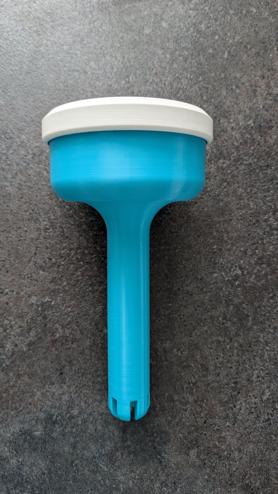
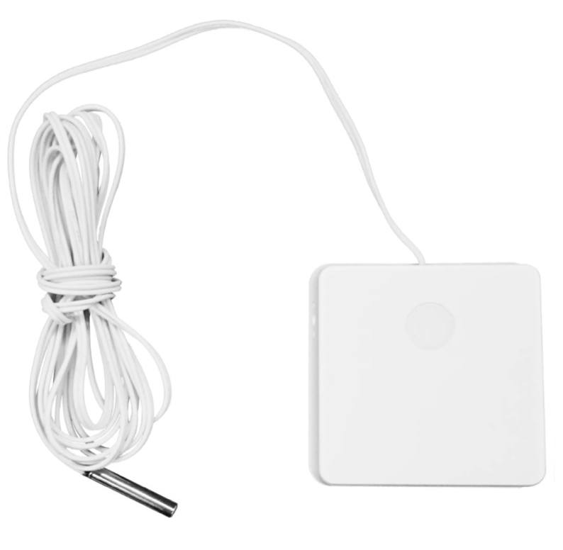
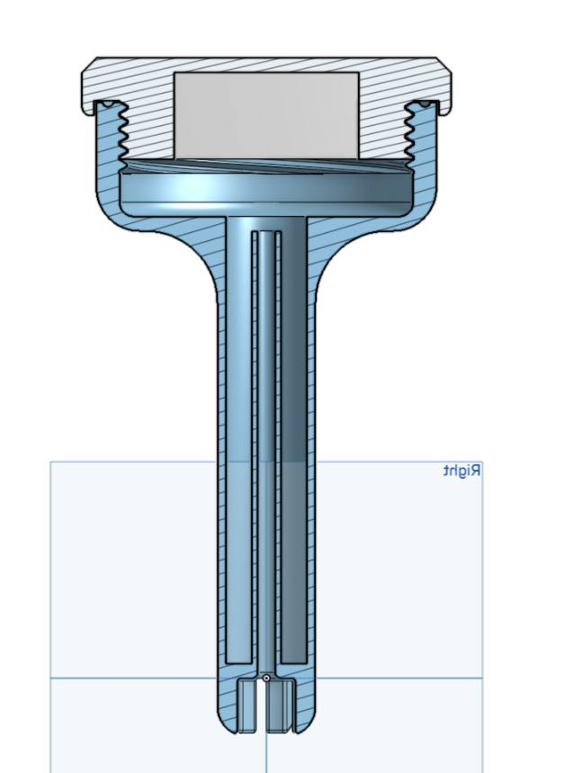
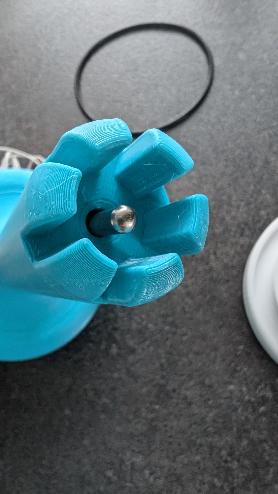
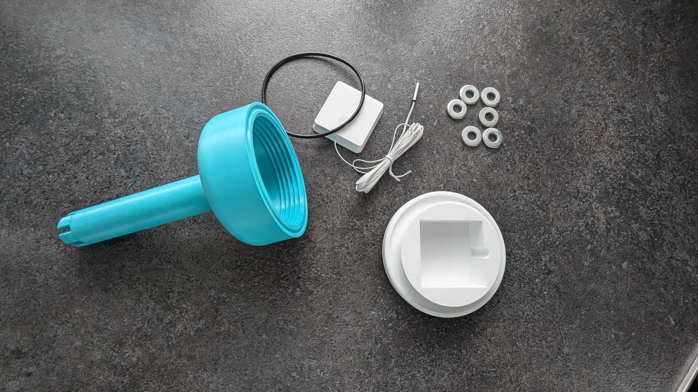
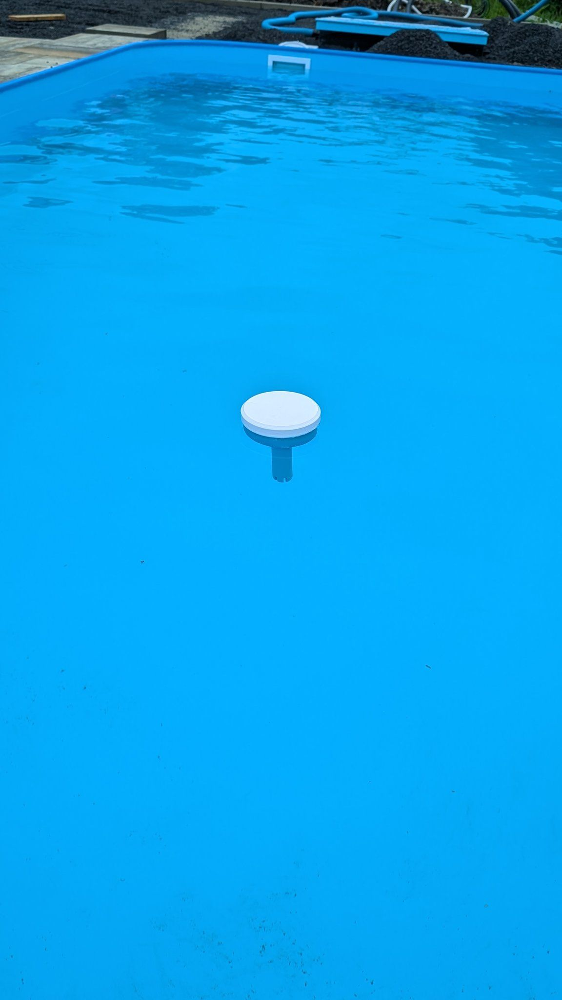

# pool_float_zigbee_thermometer
<h1 align="center">
  Float zigbee thermometer
</h1>

Zigbee, temperature, pool

## Hardware
* OWON - THS317
  
https://www.zigbee2mqtt.io/devices/THS317-ET.html
https://www.pamitech.cz/kabelovy-zigbee-sensor-teploty/

## 3D Print
* tělo plováku a víčko

  *.stl ve složče
* link onshape.com
  https://cad.onshape.com/documents/932d7e88307fcaaf0e04a0a5/w/9a7b19f1157a45011c975ee0/e/a637149c2991e96c793bdba7?renderMode=0&uiState=66a6326d841560686c4dbca0

******************************

